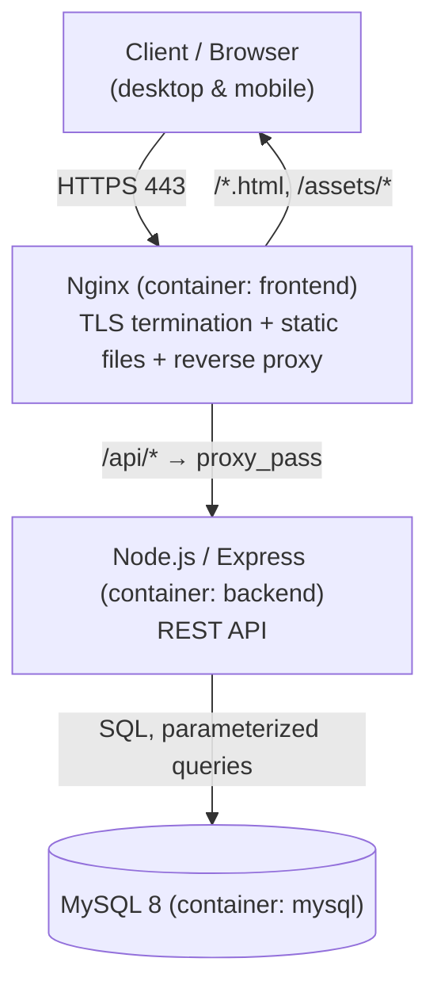

# Dokumentasi Teknis & Keamanan
## Aplikasi Pendaftaran Tamu PUSSIBERAL

Dokumen ini mencakup arsitektur sistem, skema database, role-based access
control (RBAC), daftar fitur, langkah keamanan yang diterapkan, serta hasil
perbaikan dari laporan vulnerability scanner. Dokumen ini melengkapi:

- `01_requirements_pendaftaran_tamu_pussiberal.md`
- `02_arsitektur_aplikasi_pendaftaran_tamu_pussiberal.md`
- `03_phase_pengerjaan_aplikasi_pendaftaran_tamu_pussiberal.md`

---

## 1. Arsitektur Sistem

### 1.1 Gambaran Umum

Arsitektur 3-tier, dijalankan sebagai tiga container Docker Compose di satu
server, dengan Nginx sebagai reverse proxy dan terminasi TLS di depan.



### 1.2 Komponen

| Komponen | Teknologi | Peran |
|---|---|---|
| Frontend | HTML/CSS/JS murni (tanpa framework), multi-page | Form pendaftaran, daftar tamu, verifikasi, laporan, manajemen user, log aktivitas |
| Reverse proxy / TLS | Nginx 1.27 (Alpine) | Terminasi HTTPS, redirect HTTP→HTTPS, security headers, proxy `/api/*` ke backend |
| Backend API | Node.js 20 (Alpine) + Express 4 | Autentikasi, otorisasi (RBAC), validasi, business logic, audit log |
| Database | MySQL 8.0 | Penyimpanan data tamu, user, kendaraan, kunjungan, audit log |
| Orkestrasi | Docker Compose | 3 service: `mysql`, `backend`, `frontend`, 1 network internal, volume persisten untuk data MySQL |

### 1.3 Struktur Direktori Proyek

```text
pussiberal-app/
├── docker-compose.yml
├── .env                      # kredensial & secret (tidak masuk dokumentasi ini)
├── db/
│   └── init.sql              # schema awal (dijalankan otomatis saat volume MySQL baru)
├── backend/
│   ├── Dockerfile
│   ├── package.json
│   └── src/
│       ├── index.js          # bootstrap Express, rate limiter, mount routes
│       ├── db.js             # koneksi pool MySQL
│       ├── middleware/auth.js
│       ├── routes/           # auth, guests, users, reports, auditLogs
│       └── utils/            # validators, audit logger, asyncHandler
├── frontend/
│   ├── Dockerfile
│   ├── nginx.conf            # TLS, security headers, reverse proxy
│   └── public/
│       ├── *.html            # login, dashboard, pendaftaran, daftar-tamu,
│       │                       detail-tamu, laporan, users, audit-log
│       └── assets/
│           ├── style.css     # design system + responsive breakpoints
│           └── *.js          # satu file JS per halaman + app.js (shared)
└── certs/
    └── server.crt / server.key   # sertifikat TLS self-signed
```

### 1.4 Deployment

- Server: Ubuntu 24.04 LTS, Docker Engine + Docker Compose plugin
- Akses publik: `https://187.52.126.252` (HTTP otomatis redirect ke HTTPS)
- Sertifikat TLS: **self-signed** (belum ada domain terdaftar untuk server ini).
  Browser akan menampilkan peringatan "Not Secure" pada kunjungan pertama —
  ini normal untuk self-signed cert dan tidak berarti koneksi tidak terenkripsi.
- Nginx native (di luar Docker) yang semula terpasang di server sudah
  dinonaktifkan; port 80/443 sepenuhnya dilayani oleh container `frontend`.

---

## 2. Skema Database

### 2.1 Tabel `users`

| Field | Tipe | Keterangan |
|---|---|---|
| id | INT PK | |
| username | VARCHAR(50) UNIQUE | |
| password_hash | VARCHAR(255) | bcrypt, cost factor 10 |
| full_name | VARCHAR(150) | |
| role | ENUM('admin','verifikator','pos_depan') | lihat [Bab 3](#3-role-based-access-control-rbac) |
| is_active | TINYINT(1) | nonaktif = tidak bisa login |
| created_at / updated_at | DATETIME | |

### 2.2 Tabel `guests`

| Field | Tipe | Keterangan |
|---|---|---|
| id | INT PK | |
| registration_number | VARCHAR(30) UNIQUE | format `REG-YYYYMMDD-NNNNNN`, dibuat otomatis dari ID |
| full_name, nik, phone_number, company, position, purpose | — | data identitas & keperluan tamu |
| photo | MEDIUMTEXT NULL | foto tamu, disimpan sebagai data URL base64 (JPEG, hasil kompresi client-side) |
| status | ENUM | `Draft, Terdaftar, Menunggu Verifikasi, Disetujui, Ditolak, Sedang Berkunjung, Selesai` |
| created_by | INT FK → users.id | |
| created_at / updated_at | DATETIME | |

### 2.3 Tabel `vehicles`

| Field | Tipe | Keterangan |
|---|---|---|
| id | INT PK | |
| guest_id | INT FK → guests.id (CASCADE) | |
| vehicle_type, plate_number | — | opsional |

### 2.4 Tabel `visits`

| Field | Tipe | Keterangan |
|---|---|---|
| id | INT PK | |
| guest_id | INT FK → guests.id (CASCADE) | |
| check_in_at / check_out_at | DATETIME NULL | |
| status | ENUM('Belum Check-in','Sedang Berkunjung','Selesai') | |

### 2.5 Tabel `audit_logs`

| Field | Tipe | Keterangan |
|---|---|---|
| id | INT PK | |
| user_id | INT FK → users.id | pelaku aksi (NULL jika sistem) |
| action | VARCHAR(100) | `login, create_guest, update_guest, verify_guest, check_in, check_out, delete_guest, create_user, update_user, delete_user` |
| object_type / object_id | — | entitas yang terdampak |
| detail | TEXT (JSON) | ringkasan perubahan; field foto sengaja **tidak** disimpan penuh (lihat [5.6](#56-audit-log-tidak-membengkak-oleh-foto)) |
| timestamp | DATETIME | |

---

## 3. Role-Based Access Control (RBAC)

Tiga role, ditegakkan di **backend** (bukan hanya disembunyikan di UI):

| Aksi | Administrator | Verifikator | Pos Depan |
|---|:---:|:---:|:---:|
| Login & lihat dashboard | ✅ | ✅ | ✅ |
| Daftarkan tamu baru | ✅ | ❌ | ✅ |
| Edit data tamu (nama, HP, dll) | ✅ | ❌ | ✅ |
| **Ubah/hapus foto tamu** | ✅ | ❌ | ❌ |
| Setujui / tolak pendaftaran | ✅ | ✅ | ❌ |
| Check-in / check-out tamu | ✅ | ❌ | ✅ (hanya jika status **Disetujui**) |
| Lihat & cari daftar tamu | ✅ | ✅ | ✅ |
| Lihat NIK penuh (tanpa masking) | ✅ | ✅ | ❌ (tersamar) |
| Lihat & unduh laporan (PDF/Excel) | ✅ | ✅ | ❌ |
| Kelola pengguna (CRUD) | ✅ | ❌ | ❌ |
| Lihat log aktivitas | ✅ | ❌ | ❌ |
| Hapus tamu | ✅ | ❌ | ❌ |

**Alur verifikasi:** Pos Depan mendaftarkan tamu → status otomatis
`Menunggu Verifikasi` → Verifikator menyetujui/menolak → hanya tamu berstatus
`Disetujui` yang bisa di-check-in oleh Pos Depan.

**Pengaman tambahan pada akun admin:**
- Tidak bisa menghapus akun sendiri
- Tidak bisa menonaktifkan akun sendiri
- Tidak bisa mengubah role akun sendiri
- Akun dengan riwayat aktivitas (pernah login / mendaftarkan tamu) **tidak bisa
  dihapus permanen** — sistem menolak dan menyarankan nonaktifkan saja, supaya
  jejak audit log tidak pernah menjadi yatim (orphaned).

---

## 4. Daftar Fitur

| Fitur | Keterangan |
|---|---|
| Autentikasi | Login berbasis JWT (masa berlaku token 8 jam) |
| Pendaftaran tamu | Form dengan validasi NIK (16 digit), format HP Indonesia, field wajib sesuai `01_requirements` |
| Nomor registrasi otomatis | Format `REG-YYYYMMDD-NNNNNN` |
| Cegah duplikat | NIK yang sama tidak bisa didaftarkan ulang selagi masih aktif di hari yang sama |
| Foto tamu | Ambil foto via kamera browser (`getUserMedia`) atau unggah dari galeri; dikompresi otomatis di sisi client (maks 640px, JPEG) |
| Pencarian & filter | Berdasarkan nama, NIK, perusahaan, nomor registrasi, status |
| Verifikasi | Setujui/tolak pendaftaran (role Verifikator/Admin) |
| Check-in / check-out | Tergerbang pada status verifikasi |
| Dashboard | Ringkasan jumlah tamu, tamu hari ini, sedang berkunjung, breakdown per status |
| Laporan & export | Rekap kunjungan per rentang tanggal, unduh sebagai **PDF** atau **Excel (.xlsx)** |
| Manajemen pengguna | CRUD lengkap: tambah, edit (nama/role/password), nonaktifkan, hapus permanen (dengan pengaman referential integrity) |
| Log aktivitas | Riwayat seluruh aksi penting di sistem, hanya untuk Administrator, dengan filter aksi/tanggal/pencarian |
| Desain responsif | Breakpoint untuk tablet (≤850px) dan HP (≤700px, ≤480px); sidebar collapse ke ikon, tabel scroll horizontal, layout tumpuk vertikal |

---

## 5. Keamanan yang Diterapkan

### 5.1 Transport & Header HTTP

```nginx
Strict-Transport-Security: max-age=7776000
X-Content-Type-Options: nosniff
X-Frame-Options: DENY
Referrer-Policy: strict-origin-when-cross-origin
Content-Security-Policy: default-src 'self'; script-src 'self';
  style-src 'self' 'unsafe-inline'; img-src 'self' data:; font-src 'self';
  connect-src 'self'; object-src 'none'; base-uri 'self';
  form-action 'self'; frame-ancestors 'none'
```

- `script-src 'self'` tanpa `unsafe-inline` — seluruh JavaScript berada di
  file eksternal (`assets/*.js`), tidak ada inline `<script>` atau atribut
  `onclick=` di manapun, sehingga XSS berbasis injeksi script diblokir browser
  secara native.
- `style-src` mengizinkan `unsafe-inline` sebagai kompromi sadar — aplikasi
  memakai banyak atribut `style="..."` inline untuk tata letak. Ini tidak
  membuka celah eksekusi kode (beda risiko dengan `script-src`), hanya
  membatasi proteksi terhadap CSS-injection tingkat lanjut yang jarang terjadi.
- `server_tokens off;` di Nginx — header `Server` tidak lagi menampilkan
  nomor versi (`nginx/1.27.5` → `nginx` saja), mengurangi informasi yang
  bisa dipakai menyasar eksploitasi versi spesifik.

### 5.2 Autentikasi & Otorisasi

- Password di-hash dengan **bcrypt** (cost factor 10), tidak pernah disimpan
  atau dicatat dalam bentuk plain text.
- Setiap endpoint API memvalidasi role di **server-side** melalui middleware
  `requireRole(...)` — UI hanya menyembunyikan tombol, bukan satu-satunya
  lapisan proteksi.
- **Rate limiting** pada `/api/auth/login`: maksimum 10 percobaan gagal per
  15 menit per alamat IP (percobaan sukses tidak dihitung). Mencegah
  brute-force password. Diuji: percobaan ke-11 langsung menerima `HTTP 429`.
- Rate limiting global pada seluruh `/api/*`: 1000 request / 15 menit / IP,
  sebagai lapisan dasar terhadap penyalahgunaan/DoS ringan.
- `trust proxy` diaktifkan di Express agar rate limiter membaca IP client
  asli dari header `X-Forwarded-For` yang diteruskan Nginx, bukan IP internal
  container Nginx.

### 5.3 Proteksi Data

- **NIK** disamarkan (`327104******0099`) untuk role Pos Depan; hanya
  Administrator dan Verifikator yang melihat NIK penuh — sesuai kebutuhan
  fungsi masing-masing role.
- Validasi input **server-side** untuk semua field (NIK 16 digit numerik,
  format nomor HP Indonesia, field wajib), tidak hanya mengandalkan validasi
  di browser.
- Upload foto divalidasi: harus data URL `image/png|jpeg|webp`, maksimum
  ~3MB setelah decode, ditolak dengan pesan jelas jika tidak sesuai.

### 5.4 Pencegahan SQL Injection

Seluruh query database memakai **parameterized query** (`mysql2` named
placeholders) — tidak ada satupun input pengguna yang digabungkan langsung
ke string SQL. Nilai numerik seperti `LIMIT`/`OFFSET` untuk paginasi selalu
melalui `parseInt()` dan clamping sebelum dipakai, bukan string mentah dari
request.

### 5.5 Pencegahan XSS

- Semua data dinamis yang dirender ke DOM melalui `escapeHtml()` sebelum
  disisipkan ke `innerHTML`.
- **Perbaikan penting:** implementasi awal `escapeHtml()` memakai trik
  `textContent` → `innerHTML` yang **tidak meng-escape tanda kutip**. Ini
  menjadi celah nyata karena beberapa tempat (mis. halaman Manajemen
  Pengguna) menyisipkan nilai ke dalam atribut HTML (`data-username="..."`).
  Diperbaiki menjadi escape manual (`&amp; &lt; &gt; &quot; &#39;`) yang
  aman di konteks teks maupun atribut.
- Foto tamu dirender lewat properti `.src` DOM secara langsung (bukan string
  HTML), dan divalidasi backend harus berformat `data:image/...` — tidak ada
  jalur untuk menyuntik HTML/JS lewat field ini.

### 5.6 Audit Log Tidak Membengkak oleh Foto

Saat field foto diubah/dihapus, log aktivitas mencatat `[foto diperbarui]`
atau `[foto dihapus]`, **bukan** data base64 penuh (yang bisa mencapai
beberapa MB) — mencegah tabel `audit_logs` membengkak tanpa perlu.

### 5.7 Lain-lain

- `CORS` middleware **dihapus** — frontend dan API dilayani dari origin yang
  sama lewat reverse proxy Nginx, sehingga tidak ada kebutuhan permintaan
  lintas-origin yang sah untuk diizinkan.
- `robots.txt` berisi `Disallow: /` — mencegah sistem internal ini terindeks
  mesin pencari publik.

---

## 6. Hasil Vulnerability Scan & Perbaikan

Scan dilakukan oleh pihak eksternal menggunakan **Pentest-Tools.com Website
Vulnerability Scanner (Light scan, 40 test)** pada `26 Agustus 2026`,
menyasar `https://187.52.126.252/`. Hasil: **0 Critical, 0 High, 1 Medium,
5 Low, 1 Info**.

| # | Temuan | Level | Status | Perbaikan |
|---|---|---|---|---|
| 1 | Sertifikat SSL tidak dipercaya | Medium | ⚠️ Belum bisa dituntaskan | Root cause: sertifikat self-signed karena belum ada domain. Let's Encrypt butuh domain terdaftar (tidak bisa untuk alamat IP telanjang). **Tindak lanjut:** upgrade ke sertifikat terpercaya begitu domain tersedia. |
| 2 | Header `Content-Security-Policy` hilang | Low | ✅ Diperbaiki | Ditambahkan CSP ketat di Nginx (lihat [5.1](#51-transport--header-http)) |
| 3 | Header `Strict-Transport-Security` hilang | Low | ✅ Diperbaiki | `max-age=7776000` (lihat catatan risiko di bawah) |
| 4 | Header `Referrer-Policy` hilang | Low | ✅ Diperbaiki | `strict-origin-when-cross-origin` |
| 5 | Header `X-Content-Type-Options` hilang | Low | ✅ Diperbaiki | `nosniff` |
| 6 | File `security.txt` hilang | Low | ⏸️ Menunggu keputusan | Butuh alamat kontak keamanan resmi dari organisasi — belum dibuat karena tidak ingin mengarang kontak palsu |
| 7 | Versi server (Nginx 1.27.5) terekspos | Info | ✅ Diperbaiki | `server_tokens off;` |

**Catatan HSTS:** nilai `max-age` sengaja diset 90 hari (memenuhi ambang
minimum yang direkomendasikan scanner: 7.776.000 detik), bukan 1 tahun.
Alasannya: pada sertifikat self-signed, HSTS yang di-cache browser bisa
membuat akses **benar-benar terblokir tanpa opsi "lanjutkan"** jika suatu
saat sertifikat berubah/kedaluwarsa — beda dengan peringatan sertifikat
biasa yang masih bisa di-bypass. Nilai 90 hari membatasi jendela risiko ini.
Rekomendasi: naikkan ke 1 tahun + tambahkan `preload` setelah pindah ke
sertifikat terpercaya (Let's Encrypt) dengan domain resmi.

**Cakupan scan:** laporan ini adalah *Light scan* — secara eksplisit belum
menguji SQL Injection, XSS, Command Injection, XXE, dsb. secara mendalam.
Bab [5.4](#54-pencegahan-sql-injection) dan [5.5](#55-pencegahan-xss) di
atas adalah hasil audit kode mandiri (bukan dari laporan scanner ini) untuk
menutup celah pada area yang tidak tercakup scan ringan tersebut.

---

## 7. Risiko Terbuka & Rekomendasi Tindak Lanjut

| Risiko | Prioritas | Rekomendasi |
|---|---|---|
| Sertifikat TLS self-signed | Sedang | Daftarkan domain, pasang Let's Encrypt |
| `security.txt` belum ada | Rendah | Perlu kontak keamanan resmi dari organisasi |
| **Password akun `Kaurpam` masih literal "admin"** | **Tinggi** | **Ganti segera.** Rate limiter memperlambat brute-force tapi tidak menghilangkan risiko — password ini adalah tebakan pertama siapa pun, dan akun ini berrole Administrator (akses penuh). Sistem sudah terbukti di-scan pihak luar. |
| Backup database otomatis belum berjalan | Sedang | Sesuai `03_phase` fase MVP — jadwalkan backup terenkripsi berkala + uji restore |

---

## 8. Riwayat Perubahan Signifikan

| Tahap | Ringkasan |
|---|---|
| Setup awal | Instalasi Nginx + Docker Engine di server, verifikasi dasar |
| MVP awal | Backend Express + MySQL + Docker Compose, frontend sesuai desain contoh, deploy pertama |
| HTTPS | Sertifikat self-signed, redirect HTTP→HTTPS |
| RBAC v2 | Redesain role dari (Admin/Petugas/Pimpinan) → (Administrator/Verifikator/Pos Depan) dengan alur verifikasi bertingkat |
| Manajemen pengguna | Tambah kemampuan edit & hapus user, dengan pengaman self-protection dan referential integrity |
| Responsif + Kamera | Breakpoint mobile diperkuat; fitur ambil foto via kamera/upload galeri pada form pendaftaran |
| Kontrol foto | Pembatasan ubah/hapus foto khusus Administrator |
| Log aktivitas | Halaman & endpoint baru untuk melihat `audit_logs` (khusus Administrator) |
| Hardening keamanan | Perbaikan temuan vulnerability scanner + audit kode mandiri (bab 5–6 dokumen ini) |
