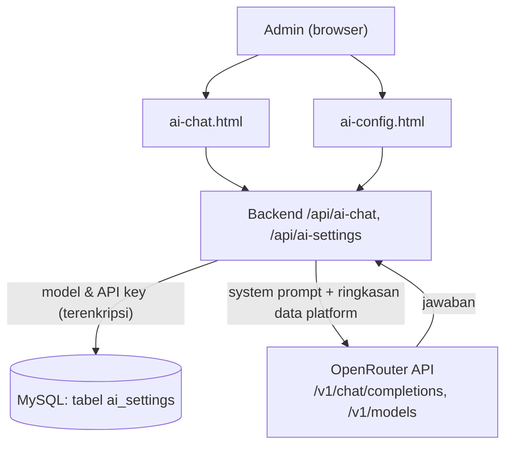

# Fitur AI Chat & Migrasi Alur Deployment
## Aplikasi Pendaftaran Tamu PUSSIBERAL

Dokumen ini mencatat pekerjaan yang dilakukan pada **27 Agustus 2026**: penambahan
fitur AI Chat berbasis OpenRouter, perbaikan bug kritikal pada deployment, dan
migrasi alur deploy dari `scp` manual ke `git pull`. Dokumen ini melengkapi:

- `01_requirements_pendaftaran_tamu_pussiberal.md`
- `02_arsitektur_aplikasi_pendaftaran_tamu_pussiberal.md`
- `03_phase_pengerjaan_aplikasi_pendaftaran_tamu_pussiberal.md`
- `04_dokumentasi_teknis_dan_keamanan.md`

---

## 1. Fitur Baru: AI Chat & Konfigurasi AI

Dua menu baru, **khusus Administrator**, ditambahkan ke sidebar aplikasi.

### 1.1 AI Chat (`ai-chat.html`)

Chat interaktif untuk menganalisa data platform — statistik kunjungan tamu,
kategori keamanan personel, bank data, dan aktivitas pengguna — tanpa perlu
membuka menu Laporan/Bank Data satu per satu.

- UI chat dengan bubble user/assistant, indikator "mengetik", dan tombol saran
  pertanyaan siap pakai.
- Riwayat percakapan dikirim ulang tiap request (stateless di backend, tidak
  disimpan permanen) — pola standar untuk API chat completion.
- Setiap pertanyaan dicatat ke `audit_logs` (aksi `ai_chat_query`, isi pesan
  dipotong 500 karakter) untuk akuntabilitas, tanpa menyimpan jawaban AI.

### 1.2 Konfigurasi AI (`ai-config.html`)

- Input **API key OpenRouter** (disimpan terenkripsi, lihat [2.2](#22-enkripsi-api-key)).
  Field API key **tidak pernah** dikembalikan oleh API — endpoint GET hanya
  mengirim flag `has_api_key: true/false`.
- Input **Model** berupa pencarian (`<input list>` + `<datalist>`) yang
  terhubung ke katalog live OpenRouter (`GET /api/ai-settings/models`),
  sehingga admin bisa memilih **model apa pun dari vendor mana pun** (Anthropic,
  OpenAI, Google, Meta, dll) — bukan daftar tetap.
- Textarea instruksi tambahan (system prompt kustom), digabung dengan instruksi
  dasar bawaan sistem saat memanggil AI.

### 1.3 Mengapa OpenRouter, bukan Anthropic langsung

Implementasi awal memanggil Claude (Anthropic) langsung. Atas permintaan
eksplisit, diganti total ke **OpenRouter** — sebuah gateway yang meneruskan ke
ratusan model dari berbagai vendor lewat satu API key dan format request yang
kompatibel dengan OpenAI (`/v1/chat/completions`). Dampaknya:

- Dependency `@anthropic-ai/sdk` **dihapus**, diganti pemanggilan `fetch` native
  Node.js 20 ke `https://openrouter.ai/api/v1/chat/completions` — tidak ada
  dependency baru yang ditambahkan.
- Admin bebas memilih model sesuai kebutuhan (kualitas vs biaya vs kecepatan),
  termasuk **model gratis** (lihat [4](#4-riset-model-gratis-openrouter)).

---

## 2. Arsitektur & Implementasi Backend



### 2.1 Tabel `ai_settings`

Baris tunggal (`id` selalu 1), dibuat otomatis saat backend start
(`ensureAiSettingsTable()` di `backend/src/utils/aiSettings.js`) — idempoten,
aman dijalankan setiap deploy.

| Field | Tipe | Keterangan |
|---|---|---|
| id | TINYINT PK | selalu `1` (CHECK constraint) |
| provider | VARCHAR(50) | `openrouter` |
| model | VARCHAR(150) | format `vendor/model`, mis. `anthropic/claude-opus-5` |
| api_key_encrypted | TEXT NULL | lihat [2.2](#22-enkripsi-api-key) |
| system_prompt | TEXT NULL | instruksi tambahan opsional dari admin |
| updated_by | INT FK → users.id | |
| updated_at | DATETIME | |

Migrasi ringan disertakan: instalasi lama yang sempat memakai model Anthropic
langsung (format tanpa prefix vendor, mis. `claude-opus-5`) otomatis
diperbarui ke default OpenRouter — **hanya** jika API key belum pernah diisi,
supaya konfigurasi nyata tidak pernah tertimpa.

### 2.2 Enkripsi API Key

`backend/src/utils/crypto.js` — AES-256-GCM, kunci diturunkan dari
`JWT_SECRET` yang sudah ada (SHA-256 hash, 32 byte) sehingga tidak perlu
variabel `.env` baru. IV acak 12 byte per enkripsi, disimpan bersama auth tag
sebagai satu string base64.

### 2.3 Endpoint API Baru

| Endpoint | Role | Keterangan |
|---|---|---|
| `GET /api/ai-settings` | admin | Provider, model, system prompt, `has_api_key` (bukan key aslinya) |
| `PUT /api/ai-settings` | admin | Update sebagian field; API key hanya diganti jika field diisi |
| `GET /api/ai-settings/models` | admin | Proxy katalog live OpenRouter, di-cache 10 menit di memori backend |
| `POST /api/ai-chat/query` | admin | Body `{ message, history[] }` → jawaban AI |

### 2.4 Konteks Data yang Dikirim ke AI

`buildPlatformContext()` di `backend/src/routes/aiChat.js` menyusun ringkasan
teks real-time dari database (bukan dump mentah) sebagai bagian dari system
prompt: total & status pendaftaran, distribusi kategori keamanan personel,
distribusi status perangkat elektronik, jumlah NIK unik, **jumlah NIK yang
tercatat dengan >1 nama berbeda** (deteksi anomali identitas), 5 perusahaan
teraktif, jumlah pengguna aktif per role, dan tren pendaftaran 7 hari
terakhir. Model diinstruksikan untuk **hanya** memakai angka dari ringkasan
ini dan jujur menyatakan jika data yang ditanyakan tidak tersedia di sana.

---

## 3. Bug Kritikal yang Ditemukan & Diperbaiki

### 3.1 Semua Menu Hilang Setelah Deploy Pertama

**Gejala:** setelah deploy pertama fitur AI Chat, seluruh halaman kehilangan
styling (font default browser) dan menu sidebar kosong total.

**Root cause:** `scp -r` dari Windows ke server membuat direktori
`frontend/public/assets/` dengan permission `700` (root-only) alih-alih `755`.
Karena proses `nginx` di dalam container berjalan sebagai user non-root,
`app.js`, `style.css`, dan seluruh skrip per-halaman menjadi tidak terbaca
(`404`) — akibatnya JavaScript maupun CSS gagal total.

**Perbaikan:** `chmod -R` di server sebagai perbaikan darurat, lalu
`docker compose build --no-cache` (build pertama sempat memakai *layer cache*
lama yang masih membawa permission salah — build ulang tanpa cache diperlukan
agar perbaikan benar-benar terbawa ke image).

**Perbaikan permanen:** migrasi ke deployment berbasis `git` (lihat
[5](#5-migrasi-alur-deployment-scp--git-pull)) — `git clone`/`git pull` tidak
pernah membawa permission aneh seperti `scp` dari Windows, sehingga kelas bug
ini tidak bisa terulang lagi ke depannya.

### 3.2 Balasan AI Kosong Tanpa Keterangan

**Gejala:** beberapa model (terutama tier gratis OpenRouter) sesekali
mengembalikan `HTTP 200` tapi tanpa isi `choices` yang valid — chat
menampilkan bubble kosong tanpa penjelasan.

**Perbaikan:** `backend/src/routes/aiChat.js` sekarang mendeteksi balasan
kosong dan mengembalikan pesan error eksplisit ke pengguna, alih-alih diam-diam
menampilkan bubble kosong.

### 3.3 Bug yang Dicegah Sebelum Sempat Terjadi (Ditemukan Saat Development)

- **Konflik `temperature` + adaptive thinking pada model Claude terbaru** —
  Claude Opus 5/Sonnet 5 mengaktifkan *adaptive thinking* secara default, dan
  menolak (`400`) permintaan yang menyertakan `temperature`/`top_p`/`top_k`
  bersamaan. Field temperature dihapus dari desain awal sebelum sempat
  dipakai produksi.
- **`max_tokens` terlalu kecil** — nilai awal `2048` berisiko habis oleh token
  *reasoning* tersembunyi sebelum sempat menulis jawaban akhir. Dinaikkan ke
  nilai yang lebih aman sebelum dipakai.

---

## 4. Riset Model Gratis OpenRouter

Atas permintaan pengguna untuk memakai model gratis, dilakukan pengujian
reliabilitas nyata (3× percobaan per model, pertanyaan identik, lewat endpoint
produksi):

| Model | Hasil Uji | Catatan |
|---|---|---|
| `nvidia/nemotron-3-ultra-550b-a55b:free` | ❌ 1/3 berhasil | Model terbesar, tapi tidak stabil di production |
| `z-ai/glm-5.2:free` | ❌ 0/3 | Rate limited terus-menerus |
| `google/gemma-4-31b-it:free` | ❌ 0/3 | Rate limited terus-menerus |
| `openrouter/free` (auto-router) | ✅ 3/3 | Otomatis pindah ke model gratis lain yang sehat |
| **`minimax/minimax-m3:free`** | ✅ **3/3** | **Dipakai sebagai default** — jawaban paling lengkap & akurat, context 1M token |

**Kesimpulan:** reliabilitas model gratis OpenRouter **bervariasi jauh** antar
model dan bisa berubah sewaktu-waktu (tergantung beban di sisi penyedia).
Default produksi saat ini: **`minimax/minimax-m3:free`**, dengan
**`openrouter/free`** sebagai alternatif cadangan yang terbukti sama-sama
reliable. Untuk kebutuhan yang mengutamakan keandalan konsisten, model
berbayar (mis. `anthropic/claude-opus-5`) tetap lebih disarankan.

---

## 5. Migrasi Alur Deployment: `scp` → `git pull`

### 5.1 Sebelum

Deploy dilakukan manual: `scp -r` seluruh folder `backend`/`frontend`/`db` dari
komputer Windows ke server, lalu `docker compose build && up -d`. Rawan bug
permission (lihat [3.1](#31-semua-menu-hilang-setelah-deploy-pertama)) dan
tidak ada riwayat perubahan yang terlacak di server.

### 5.2 Temuan Penting

Repository git **ternyata sudah ada** sebelumnya di `Guest cYGNUS/.git`
(tersembunyi, satu level di atas folder `pussiberal-app/`), sudah terhubung ke
`github.com/sagala274/cygnusguest`, dengan 2 commit riwayat sebelumnya. Sempat
keliru membuat repo baru *di dalam* `pussiberal-app/` — sudah dibersihkan dan
memakai repo asli tersebut.

### 5.3 Setelah

- Kode di-*commit* & *push* ke `github.com/sagala274/cygnusguest` (autentikasi
  via SSH key `github_ed25519`, didaftarkan manual oleh pengguna di GitHub).
- Server: `/opt/pussiberal` sekarang adalah **symlink** ke
  `/opt/cygnusguest/pussiberal-app` (hasil `git clone`, repo publik → tidak
  perlu kredensial di server).
- Data runtime (`.env`, `backups/`, `certs/`) dipindahkan dengan aman ke lokasi
  baru — tidak ada data yang hilang (termasuk backup harian/mingguan/bulanan
  yang sudah pernah dibuat).
- Direktori lama disimpan sebagai `/opt/pussiberal.pre-git-bak` (belum
  dihapus, sebagai jaring pengaman).
- `docker-compose.yml` diberi `name: pussiberal` eksplisit (menghilangkan
  warning "loaded without an explicit name from a symlink").

### 5.4 Alur Deploy Baru

```bash
# Di komputer lokal, setelah selesai mengedit:
git add -A && git commit -m "pesan commit" && git push origin main

# Di server:
ssh root@187.52.126.252 \
  "cd /opt/cygnusguest && git pull && cd pussiberal-app && docker compose build && docker compose up -d"
```

`.gitignore` di root repo (`Guest cYGNUS/.gitignore`) memastikan `.env`,
`backups/`, `certs/`, `node_modules/`, dan `.claude/` (data sesi Claude Code)
**tidak pernah** ikut ter-commit — sudah diverifikasi eksplisit sebelum setiap
push pada sesi ini.

---

## 6. Berkas yang Ditambahkan/Diubah

| Berkas | Perubahan |
|---|---|
| `backend/src/utils/crypto.js` | **Baru** — enkripsi AES-256-GCM untuk API key |
| `backend/src/utils/aiSettings.js` | **Baru** — akses tabel `ai_settings`, migrasi ringan |
| `backend/src/routes/aiSettings.js` | **Baru** — endpoint konfigurasi + katalog model |
| `backend/src/routes/aiChat.js` | **Baru** — endpoint chat, konteks platform, panggilan OpenRouter |
| `backend/src/index.js` | Mount route baru, panggil `ensureAiSettingsTable()` saat start |
| `backend/package.json` | `@anthropic-ai/sdk` sempat ditambah lalu dihapus (migrasi ke OpenRouter) |
| `db/init.sql` | Tabel `ai_settings` untuk instalasi baru |
| `frontend/public/ai-chat.html` + `assets/ai-chat.js` | **Baru** — halaman chat |
| `frontend/public/ai-config.html` + `assets/ai-config.js` | **Baru** — halaman konfigurasi |
| `frontend/public/assets/app.js` | Tambah 2 menu sidebar (admin-only), label aksi audit log baru |
| `frontend/public/assets/style.css` | Kelas CSS untuk chat bubble, indikator mengetik, saran pertanyaan |
| `frontend/nginx.conf` | `proxy_read_timeout 180s` khusus `/api/` — respons AI bisa lebih lama dari default 60s |
| `docker-compose.yml` | `name: pussiberal` eksplisit |
| `.gitignore` (root) | Tambah `.claude/` |

---

## 7. Status Akhir & Tindak Lanjut

- ✅ AI Chat & Konfigurasi AI live di produksi, sudah diverifikasi end-to-end
  (login admin → set model → kirim pertanyaan → jawaban akurat sesuai data
  real di database).
- ✅ Bug permission asset sudah tidak mungkin terulang (deploy via git).
- ⏸️ **Rekomendasi:** pantau reliabilitas `minimax/minimax-m3:free` dari waktu
  ke waktu. Jika mulai sering gagal, ganti ke `openrouter/free` atau
  pertimbangkan model berbayar murah untuk kebutuhan yang lebih kritikal.
- ⏸️ Direktori cadangan `/opt/pussiberal.pre-git-bak` di server boleh dihapus
  setelah yakin migrasi git berjalan stabil dalam beberapa hari ke depan.
