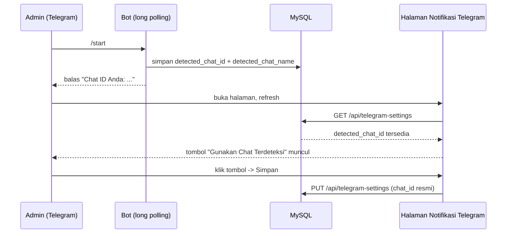

# Integrasi Notifikasi & Bot Telegram
## Aplikasi Pendaftaran Tamu PUSSIBERAL

Dokumen ini mencatat pekerjaan pada **27 Agustus 2026** (lanjutan hari yang sama
dengan `05_ai_chat_dan_migrasi_deployment.md`): penambahan integrasi Telegram
untuk memantau pendaftaran tamu dan log akses sistem, serta perbaikan dua bug
deployment yang ditemukan saat prosesnya. Dokumen ini melengkapi:

- `04_dokumentasi_teknis_dan_keamanan.md`
- `05_ai_chat_dan_migrasi_deployment.md`

---

## 1. Fitur Baru: Notifikasi & Bot Telegram

Menu baru **"Notifikasi Telegram"** (khusus Administrator) di
`telegram-settings.html`, plus bot Telegram interaktif.

### 1.1 Notifikasi Otomatis (Push)

Dikirim real-time (fire-and-forget, tidak memblokir/menggagalkan request
utama jika Telegram error) saat:

| Event | Trigger di kode | Bisa dimatikan? |
|---|---|---|
| Pendaftaran tamu baru | `POST /api/guests` di `guests.js` | Ya, toggle "notify_new_registration" |
| Login / akses sistem | `POST /api/auth/login` di `auth.js` | Ya, toggle "notify_login" |

### 1.2 Bot Interaktif (Long Polling)

Bot berjalan lewat **long polling** ke `getUpdates` (bukan webhook — webhook
butuh sertifikat TLS yang dipercaya publik, sementara server ini masih
memakai sertifikat self-signed; lihat bagian "Sertifikat SSL tidak dipercaya"
pada `04_dokumentasi_teknis_dan_keamanan.md` bab 6). Perintah yang dilayani:

| Perintah | Fungsi |
|---|---|
| `/start` | Membalas dengan Chat ID pengirim + menyimpannya sebagai "chat terdeteksi" |
| `/status` | Ringkasan jumlah tamu (total, hari ini, sedang berkunjung, distribusi status) |
| `/tamu` | 5 pendaftaran tamu terbaru |
| `/log` | 5 aktivitas terbaru dari `audit_logs` |
| `/help` | Daftar perintah |

**Pengaman akses:** semua perintah selain `/start` hanya dilayani jika
`chat.id` pengirim **sama persis** dengan `chat_id` yang tersimpan di
konfigurasi — mencegah siapa pun yang menemukan username bot ini menarik data
internal sistem hanya dengan mengirim pesan ke bot.

### 1.3 Alur "Deteksi Chat ID" (UX)

Alih-alih meminta admin mencari Chat ID secara manual, dibuat alur otomatis:

Sengaja **tidak** memanggil `getUpdates` langsung dari endpoint pengaturan —
kalau dua konsumen (poller bot yang jalan terus + endpoint ini) memanggil
`getUpdates` bersamaan dengan `offset` yang tidak sinkron, salah satunya bisa
"mencuri" (meng-acknowledge) update yang belum sempat diproses yang lain.
Deteksi chat cukup mengandalkan hasil yang sudah disimpan poller ke database.

---

## 2. Arsitektur & Implementasi Backend

### 2.1 Tabel `telegram_settings`

Baris tunggal (`id` selalu 1), sama polanya dengan `ai_settings`.

| Field | Tipe | Keterangan |
|---|---|---|
| id | TINYINT PK | selalu `1` |
| bot_token_encrypted | TEXT NULL | AES-256-GCM, kunci dari `JWT_SECRET` (sama seperti API key AI) |
| chat_id | VARCHAR(50) NULL | Chat ID resmi tujuan notifikasi (bisa negatif untuk grup) |
| notify_new_registration | TINYINT(1) | default `1` |
| notify_login | TINYINT(1) | default `1` |
| last_update_id | BIGINT | offset polling terakhir, dipersist agar aman lintas restart container |
| detected_chat_id / detected_chat_name | VARCHAR | hasil `/start` terakhir, dipakai tombol "Gunakan Chat Terdeteksi" |
| updated_by | INT | admin terakhir yang mengubah |

### 2.2 Berkas Baru

| Berkas | Isi |
|---|---|
| `backend/src/utils/telegram.js` | Bootstrap tabel, enkripsi token, `sendTelegramMessage()`, `notifyNewRegistration()`, `notifyLogin()`, escaping MarkdownV2 |
| `backend/src/utils/telegramBot.js` | Loop long-polling (`getUpdates`), dispatcher perintah bot |
| `backend/src/routes/telegramSettings.js` | `GET/PUT /api/telegram-settings`, `POST /api/telegram-settings/test` |
| `frontend/public/telegram-settings.html` + `assets/telegram-settings.js` | Halaman konfigurasi + panduan setup inline |

### 2.3 Detail Teknis: Escaping MarkdownV2

Pesan Telegram memakai `parse_mode: MarkdownV2`, yang **strict** — karakter
seperti `. - ( ) !` di teks biasa wajib di-escape dengan `\`, atau Telegram
menolak seluruh pesan (`400 Bad Request`). Ditemukan nuansa penting saat
development: **aturan escaping berbeda di dalam code span** (`` `teks` ``) —
di sana hanya backtick dan backslash yang perlu di-escape, karakter lain
(termasuk `-` dan `.`) harus dibiarkan apa adanya. Memakai fungsi escape yang
sama untuk teks biasa dan teks di dalam code span akan membuat backslash
tambahan muncul secara literal (mis. No. Registrasi tampil sebagai
`REG\-20260827\-000005`, bukan `REG-20260827-000005`).

**Solusi:** dua fungsi escape terpisah —
`escapeMarkdown()` untuk teks biasa, `escapeMarkdownCode()` (hanya escape
`` ` `` dan `\`) untuk teks di dalam code span. Dipakai secara konsisten di
seluruh pesan (nomor registrasi, Chat ID, alamat IP).

---

## 3. Bug Ditemukan & Diperbaiki Saat Deploy

### 3.1 Menu Baru Tidak Muncul — Lupa Rebuild Frontend

**Gejala:** setelah deploy fitur Telegram, menu "Notifikasi Telegram" tidak
tampil di sidebar sama sekali, dan `telegram-settings.html` mengembalikan
`404`.

**Root cause:** perintah deploy hanya menjalankan
`docker compose build backend` — image **frontend** (berisi HTML/JS statis,
termasuk halaman & menu baru) tidak pernah di-rebuild, jadi container
frontend masih menjalankan kode lama.

**Perbaikan:** `docker compose build frontend && docker compose up -d`.

### 3.2 Cache Browser Menahan Update Frontend

Selama investigasi bug 3.1, ditemukan penyebab yang lebih dalam dan berpotensi
berulang di setiap deploy ke depan: **nginx tidak pernah mengirim header
`Cache-Control`** untuk file HTML/JS/CSS. Browser modern melakukan *heuristic
caching* tanpa header eksplisit — artinya walau server sudah benar
ter-update, sebagian pengguna tetap bisa melihat versi lama tanpa sadar,
bahkan setelah refresh biasa.

**Perbaikan:** tambah `add_header Cache-Control "no-cache" always;` — ini
tetap mengizinkan caching (efisien, masih memakai `ETag`/304 response) tapi
**mewajibkan validasi ulang ke server di setiap request**, sehingga versi
baru selalu terdeteksi tanpa perlu hard-refresh manual.

### 3.3 Bug yang Diperkenalkan Sendiri Saat Memperbaiki 3.2

Percobaan pertama menaruh `add_header Cache-Control` di dalam sebuah
`location` block khusus (`~* \.(?:html|js|css)$`). Ini **menghapus** seluruh
header keamanan (HSTS, CSP, X-Frame-Options, dll — hasil hardening di `04`)
untuk request yang cocok dengan location tersebut — nginx punya perilaku
tidak intuitif di sini: `add_header` di dalam sebuah `location` **tidak
mewarisi** daftar `add_header` dari `server` induknya, melainkan
menggantikannya total.

**Perbaikan:** pindahkan `add_header Cache-Control` ke level `server`,
sejajar dengan header keamanan lain — satu tempat, tidak ada lagi risiko
override. Diverifikasi lewat `curl -I` bahwa seluruh header (keamanan +
cache) muncul bersamaan setelah perbaikan.

---

## 4. Langkah Setup Bot Telegram (Ringkasan)

Panduan lengkap ada langsung di halaman **Notifikasi Telegram** pada
aplikasi. Ringkasannya:

1. Cari **@BotFather** di Telegram, kirim `/newbot`, ikuti instruksinya
   (nama bebas, username harus diakhiri `bot`)
2. Salin **token** yang diberikan BotFather ke field "Bot Token" di menu
   Notifikasi Telegram, klik Simpan
3. Cari bot yang baru dibuat lewat username-nya, buka chat-nya, kirim `/start`
4. Kembali ke menu Notifikasi Telegram, refresh, klik **"Gunakan Chat
   Terdeteksi"**, klik Simpan
5. Klik **"Kirim Tes Notifikasi"** untuk memastikan semuanya tersambung

**Chat ID manual (alternatif):** kirim pesan apa saja ke bot pihak ketiga
**@userinfobot** — ia langsung membalas dengan Chat ID akun (atau grup, jika
ditambahkan ke grup tersebut).

---

## 5. Berkas yang Ditambahkan/Diubah

| Berkas | Perubahan |
|---|---|
| `backend/src/utils/telegram.js` | **Baru** |
| `backend/src/utils/telegramBot.js` | **Baru** |
| `backend/src/routes/telegramSettings.js` | **Baru** |
| `backend/src/routes/auth.js` | Panggil `notifyLogin()` setelah login sukses |
| `backend/src/routes/guests.js` | Panggil `notifyNewRegistration()` setelah pendaftaran dibuat |
| `backend/src/index.js` | Mount route baru, `ensureTelegramSettingsTable()`, `startTelegramPolling()` saat start |
| `db/init.sql` | Tabel `telegram_settings` untuk instalasi baru |
| `frontend/public/telegram-settings.html` + `assets/telegram-settings.js` | **Baru** |
| `frontend/public/assets/app.js` | Menu sidebar baru, label aksi audit `update_telegram_settings` |
| `frontend/nginx.conf` | `Cache-Control: no-cache` di level `server` |

---

## 6. Status Akhir

- ✅ Integrasi Telegram live di produksi, tabel `telegram_settings` terbentuk
  otomatis, endpoint terverifikasi merespons benar.
- ✅ Header keamanan & cache-control terverifikasi lengkap bersamaan lewat
  `curl -I` setelah perbaikan bug 3.3.
- ⏸️ **Menunggu pengguna:** menyelesaikan setup bot (buat bot via BotFather,
  kirim `/start`, hubungkan Chat ID) — belum ada bot token/Chat ID
  tersimpan di database produksi per akhir sesi ini.
- 💡 **Catatan untuk deploy selanjutnya:** perubahan yang menyentuh
  `frontend/` **wajib** `docker compose build frontend`, perubahan yang
  menyentuh `backend/` wajib `docker compose build backend` — kalau
  perubahan mencakup keduanya, build keduanya (atau jalankan
  `docker compose build` tanpa argumen untuk build semua service sekaligus,
  cara paling aman jika ragu).
