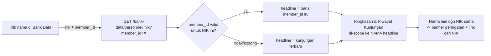

# Formulir Pendaftaran Lanjutan & Perbaikan Integritas Data
## Aplikasi Pendaftaran Tamu PUSSIBERAL

Dokumen ini mencatat pekerjaan pada **28 Agustus 2026**: penambahan field baru
di formulir pendaftaran tamu, penambahan akun pengguna, dan serangkaian
perbaikan bug pada Bank Data, zona waktu, serta laporan kunjungan. Dokumen ini
melengkapi:

- `05_ai_chat_dan_migrasi_deployment.md`
- `06_integrasi_telegram.md`

---

## 1. Akun Pengguna Baru: Danpussiberal

Diminta akun baru dengan akses terbatas: Dashboard, Daftar Tamu, Laporan, dan
Bank Data — tanpa Pendaftaran Tamu maupun Verifikasi Tamu.

Kombinasi akses ini **tidak persis cocok** dengan role yang sudah ada
(`verifikator` punya akses sama persis DITAMBAH kemampuan menyetujui/menolak
pendaftaran). Dikonfirmasi ke pengguna: apakah perlu role baru read-only, atau
cukup pakai `verifikator` yang sudah ada (dengan konsekuensi tambahan bisa
verifikasi). Dipilih opsi kedua — akun `Danpussiberal` dibuat dengan role
`verifikator`.

Catatan teknis: password awal yang diminta ("samurai", 7 karakter) tidak
memenuhi minimum 8 karakter yang ditegakkan backend — diganti jadi
`samurai123` atas konfirmasi pengguna.

---

## 2. Field Baru di Formulir Pendaftaran Tamu

Tiga field baru ditambahkan pada bagian "Perusahaan & Keperluan", menggantikan
satu field bebas "Keperluan Menghadap" yang sebelumnya berupa teks tanpa
struktur.

### 2.1 Tujuan Menghadap Kepada (checkbox multi-pilih)

Delapan pilihan: **Danpussiberal, Wadan Pussiberal, Dirbinminlogpers,
Dirbinkamsiber, Dansatdak, Dansatinasi, Dansathan, dan Lainnya** — sengaja
dibuat **multi-select** (bukan radio) karena satu kunjungan bisa saja ditujukan
ke lebih dari satu pejabat sekaligus (dikonfirmasi eksplisit ke pengguna
sebelum implementasi, karena defaultnya field seperti ini di aplikasi biasanya
single-select).

Saat opsi **"Lainnya"** dicentang, muncul kolom teks wajib diisi
("Sebutkan Tujuan Menghadap Lainnya") — pola identik dengan kebijakan
perangkat elektronik yang sudah ada (`dibawa_alasan_khusus` -> alasan wajib).

Disimpan sebagai kolom `target_officials` bertipe **SET** di MySQL (bukan
tabel relasi terpisah) — cocok untuk daftar pilihan tetap yang kecil, jauh
lebih sederhana daripada desain many-to-many penuh. Nilai "Lainnya" disertai
`target_official_other` (VARCHAR, wajib diisi kalau "lainnya" dipilih).

### 2.2 Kategori Keperluan (radio, satu pilihan)

Enam kategori: Audiensi, Rapat/Koordinasi, Diskusi Teknis, Maintenance,
Pengiriman, Lainnya. Disimpan sebagai `purpose_category` (ENUM, nullable untuk
kompatibilitas data lama).

### 2.3 Detail Tujuan Menghadap (wajib, semua kategori)

Field teks bebas yang sudah ada sebelumnya (`purpose`) direlabel dari
"Keperluan Menghadap" menjadi "Detail Tujuan Menghadap" — tetap wajib diisi
untuk **semua** kategori, bukan cuma saat kategori "Lainnya" dipilih. Untuk
kategori "Lainnya", field ini otomatis berperan sebagai penjelasan spesifik
(placeholder memberi contoh: "kegiatan cukur rambut, pengukuran baju, dll").

### 2.4 Auto-scroll Setelah Simpan

Setelah klik "Simpan Pendaftaran" — baik berhasil maupun gagal — halaman
otomatis scroll halus ke atas supaya pesan hasil (yang selalu muncul di bagian
atas formulir) langsung terlihat tanpa perlu scroll manual. Berguna terutama
untuk formulir panjang dengan banyak tamu/foto.

### 2.5 Detail Teknis: Migrasi Kolom SET di MySQL

Ditemukan saat deploy: `ALTER TABLE ... ADD COLUMN IF NOT EXISTS` yang dipakai
di migrasi kolom sebelumnya (lihat `05`) **tidak didukung MySQL** (beda dari
MariaDB) — sempat membuat backend gagal start total. Diperbaiki dengan
mengecek `information_schema.COLUMNS` secara manual dari kode sebelum
menjalankan `ALTER TABLE`. Untuk kolom tipe **SET/ENUM** secara khusus, migrasi
juga di-desain untuk selalu menjalankan `MODIFY COLUMN` (bukan cuma cek
"sudah ada atau belum") setiap kali backend start — supaya kalau daftar
pilihan bertambah lagi di masa depan (seperti saat menambah opsi "Lainnya"),
instalasi yang sudah pernah di-deploy sebelumnya ikut ter-update otomatis
tanpa migrasi manual.

---

## 3. Bug Bank Data Personel Tamu: Identitas Tercampur

Dilaporkan: mengklik nama "Yahya Matori" di Bank Data malah menampilkan
laporan "Wow Jarwo".

### 3.1 Root Cause

**Bukan bug logika** — anomali data nyata: NIK `1234567890123456` (NIK dummy,
angka berurutan) tercatat dipakai oleh **4 nama berbeda** (yahya Matori,
Doni ×2, Wow jarwo), kemungkinan besar hasil pengisian NIK asal-asalan saat
uji coba. Fitur deteksi anomali (`nik_shared_by_multiple_names`) yang sudah
ada sejak awal memang dirancang untuk menangkap kasus seperti ini.

Bug sebenarnya ada pada **cara laporan personel menampilkan data** saat
anomali ini terjadi, diperbaiki bertahap dalam 2 putaran:

**Putaran 1** — Laporan personel selalu memakai identitas dari **kunjungan
paling baru** untuk NIK tersebut, apa pun nama yang diklik. Diperbaiki dengan
menyertakan `member_id` baris yang diklik di URL, dan backend memakai baris
itu sebagai "headline" laporan (nama, jabatan, HP, afiliasi, kategori) —
bukan selalu kunjungan terbaru.

**Putaran 2** — Setelah putaran 1, pengguna melaporkan lagi: ringkasan sudah
benar (menampilkan "yahya Matori"), tapi **tabel Riwayat Kunjungan di bawahnya
masih menampilkan kunjungan ke-4 nama sekaligus tercampur** — termasuk
"Perusahaan Terkait" yang salah menghitung 4 perusahaan padahal Yahya Matori
sendiri cuma terdaftar 1 kali. Root cause lebih dalam: `visit_count` dan
`last_visit_at` dihitung **per NIK**, bukan per orang, di fungsi
`fetchAllRecords()` yang dipakai bersama oleh list Bank Data maupun laporan
personel.

### 3.2 Perbaikan Final

Statistik kunjungan (jumlah kunjungan, perusahaan terkait, kunjungan
pertama/terakhir, **dan** seluruh isi tabel Riwayat Kunjungan — termasuk versi
PDF-nya) sekarang dihitung berdasarkan **identitas** (kombinasi NIK + nama,
dinormalisasi huruf kecil), bukan NIK saja. Perbaikan ini otomatis berlaku
konsisten di list utama Bank Data, laporan personel, dan PDF ekspor — karena
semuanya memakai fungsi `fetchAllRecords()` yang sama.

Anomali **tetap tidak disembunyikan** (sesuai prinsip desain sejak awal, lihat
`04`) — nama lain yang tercatat dengan NIK yang sama disurfacekan lewat field
`other_names_same_nik` dan ditampilkan di banner peringatan, lengkap dengan
link langsung untuk mencari NIK tersebut di Bank Data (`bank-data.html?q=NIK`)
guna penelusuran lebih lanjut.

---

## 4. Bug Zona Waktu: Backend Menampilkan UTC, Bukan WIB

Dilaporkan: waktu "Dicetak" di PDF Bank Data dan waktu di notifikasi Telegram
tidak sesuai waktu Jakarta.

### 4.1 Root Cause

Server (container backend maupun MySQL) berjalan dalam **UTC** — dikonfirmasi
langsung (`date` di kedua container menunjukkan waktu UTC, `NOW()` MySQL juga
UTC). Kode memformat tanggal dengan `toLocaleString('id-ID')` **tanpa opsi
`timeZone` eksplisit** — hasilnya diformat gaya Indonesia (titik sebagai
pemisah jam) tapi jamnya tetap UTC, selisih 7 jam lebih lambat dari WIB.

Halaman web di browser pengguna **tidak terdampak** — format tanggal di sana
memakai zona waktu komputer pengguna sendiri (WIB), bukan zona waktu server.
Bug ini murni pada teks yang dibuat/diformat di sisi backend: PDF, pesan
Telegram, dan balasan bot.

### 4.2 Perbaikan

Dibuat utilitas `backend/src/utils/datetime.js` (`formatJakartaDateTime`,
`formatJakartaDate`) yang selalu menyertakan `timeZone: 'Asia/Jakarta'`,
dipakai konsisten di 6 titik: PDF Bank Data, notifikasi Telegram, balasan bot
`/tamu` `/log`, ekspor laporan kunjungan (Excel/PDF), dan ringkasan tren 7
hari di AI Chat.

**Yang sengaja TIDAK disentuh:** konfigurasi zona waktu container/database itu
sendiri, dan logika pengelompokan data per-hari (grafik dashboard, filter
"hari ini"). Mengubah itu berisiko salah menafsirkan ulang tanggal yang
**sudah tersimpan** — perbaikan dipilih yang paling aman: hanya pada langkah
tampilan akhir, tanpa menyentuh data maupun cara penyimpanannya.

---

## 5. Bug SQL: Rekap Kunjungan (Laporan) Gagal Dimuat

Dilaporkan: halaman Laporan menampilkan "Terjadi kesalahan pada server" saat
memuat Rekap Kunjungan.

### 5.1 Root Cause

Bug lama, tidak terkait perubahan zona waktu di atas. Query `fetchVisits()` di
`reports.js` mengambil `vi.check_in_at`/`vi.check_out_at` dari tabel `visits`
yang di-`LEFT JOIN`, dipakai bersama `GROUP BY g.id` — tapi kedua kolom itu
**tidak dibungkus fungsi agregat**. MySQL 8 dengan mode default
`ONLY_FULL_GROUP_BY` menolak query semacam ini karena tidak bisa memastikan
satu baris `guests` cuma berpasangan dengan satu baris `visits` (tidak ada
constraint UNIQUE di `visits.guest_id`).

Pola query yang identik di `guests.js` (untuk halaman Daftar Tamu) sudah benar
sejak awal — memakai `MAX(vi.check_in_at)` dan `MAX(vi.check_out_at)`.
`fetchVisits()` di `reports.js` saja yang terlewat menerapkan pola yang sama.

### 5.2 Perbaikan

Disamakan polanya: `MAX(vi.check_in_at) AS check_in_at, MAX(vi.check_out_at) AS check_out_at`.
Satu baris perubahan, langsung memperbaiki tombol Tampilkan, Unduh Excel, dan
Unduh PDF sekaligus (ketiganya memanggil fungsi `fetchVisits()` yang sama).

---

## 6. Berkas yang Ditambahkan/Diubah

| Berkas | Perubahan |
|---|---|
| `backend/src/utils/guestFields.js` | **Baru** — konstanta pilihan, migrasi kolom `target_officials`/`purpose_category`/`target_official_other` |
| `backend/src/utils/datetime.js` | **Baru** — helper format tanggal WIB |
| `backend/src/routes/guests.js` | Validasi & penyimpanan field baru formulir pendaftaran |
| `backend/src/routes/bankData.js` | Fix identitas headline + scoping riwayat kunjungan per nama; fix format tanggal WIB |
| `backend/src/routes/reports.js` | Fix `ONLY_FULL_GROUP_BY`; fix format tanggal WIB |
| `backend/src/routes/aiChat.js` | Fix format tanggal WIB pada ringkasan tren |
| `backend/src/utils/telegram.js` | Fix format tanggal WIB pada notifikasi; sertakan Tujuan Menghadap Kepada |
| `backend/src/utils/telegramBot.js` | Fix format tanggal WIB pada balasan bot |
| `db/init.sql` | Kolom baru `target_officials`, `target_official_other`, `purpose_category` |
| `frontend/public/pendaftaran.html` + `assets/pendaftaran.js` | 3 field baru, opsi "Lainnya", auto-scroll |
| `frontend/public/assets/detail-tamu.js` | Tampilkan field baru di detail pendaftaran |
| `frontend/public/assets/bank-data.js` | Link personel sertakan `member_id` |
| `frontend/public/bank-data-personnel.html` + `assets/bank-data-personnel.js` | Scoping laporan per identitas, banner nama lain + link pencarian NIK |
| `frontend/public/assets/app.js` | Label helper untuk pejabat tujuan & kategori keperluan |

---

## 7. Status Akhir

- ✅ Formulir pendaftaran tamu dengan 3 field baru live di produksi.
- ✅ Bug Bank Data (identitas tercampur) tuntas di kedua putaran — ringkasan
  maupun riwayat kunjungan konsisten per identitas.
- ✅ Zona waktu backend (PDF, Telegram, bot) terverifikasi WIB.
- ✅ Rekap Kunjungan di halaman Laporan berfungsi normal kembali.
- ⏸️ **Catatan untuk ditindaklanjuti:** NIK `1234567890123456` dan data terkait
  ("Doni" tercatat di "Pt. Swadaya" vs "PT swadaya" — kemungkinan typo
  kapitalisasi) adalah data uji coba yang sebaiknya dibersihkan dari basis
  data produksi.
